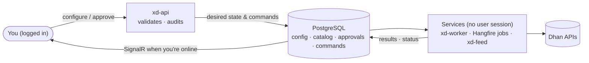
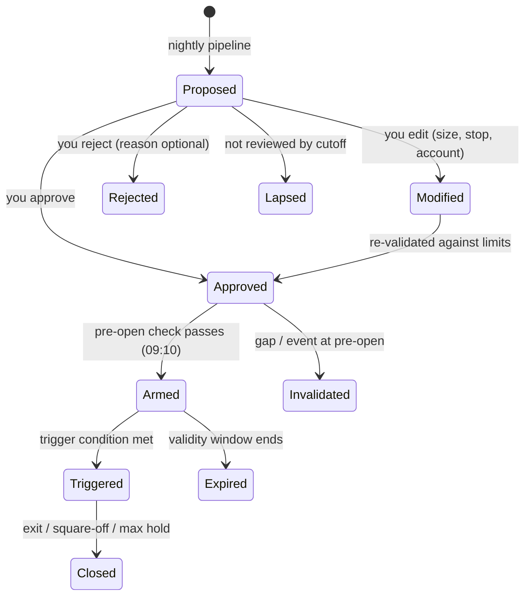

# 04 — Accounts, Access & Operating Model

Four rules shape how xDrishti is used day to day:

1. **Personal use only** — one owner, only the owner's broker accounts.
2. **Login required** — nobody else can open or use the application.
3. **Configure once, services run it** — what you set up is executed by background services on the machine,
   not by your browser session.
4. **Human in the loop** — the system and the AI *propose*; you *confirm* the decisions that matter.

## 1. Broker accounts and their roles

You can register any number of broker accounts. Each account is given one or more **roles**:

| Role | What the account is used for | Requirements |
|------|------------------------------|--------------|
| **Data** | Market data: instrument master, historical & end-of-day 1-minute data, live feed for the active set, quotes | Dhan Data API subscription on this account |
| **Trading** | Receives next-day plan tickets (sized to its capital and risk profile); auto-journal of fills; later order execution | Risk profile, capital source, allowed styles/instruments |
| **Portfolio** | Holdings, positions, trade history and ledger are synced and monitored | Sync schedule, default bucket |

One account can hold several roles at once, for example:

| Account | Data | Trading | Portfolio | Notes |
|---------|:----:|:-------:|:---------:|-------|
| Dhan · Main | ✅ primary | ✅ | ✅ | Pays the ₹499 Data API; trades and is monitored |
| Dhan · Long-term | — | — | ✅ | Monitoring only (holdings, XIRR) |
| Dhan · Swing | ✅ standby | ✅ | ✅ | Can take over data if the main account's token fails |
| Upstox · Old (later) | — | — | ✅ | Monitoring only once the Upstox adapter exists |

**Rules enforced by the system**
- Exactly **one primary Data account**; optionally one **standby** that takes over automatically if the primary's
  token or subscription fails (only if it also has an active Data API subscription).
- A Trading account must have a risk profile; plan allocation only goes to accounts with the Trading role.
- Portfolio views include only accounts with the Portfolio role (filterable per account).
- Removing a role stops the related services for that account; history is kept.
- Every role change is audited and needs re-authentication (password).

**Per-account settings:** display name, broker, client id, credential reference (secrets live in the macOS
Keychain → Podman secrets, never in the database), roles, mode (`paper` / `manual_live`; automated modes in a
later phase), risk profile, capital source, sync schedule, token status & last successful sync.

### 1.1 Accounts screen

| View | Content |
|------|---------|
| **Accounts** (list + detail) | Left: every account with roles, token health, holdings value. Right: tabs **Overview** (value, P&L, funds, token, sync) · **Roles** · **Trading** (mode, risk profile, capital source/amount, styles, allowed instruments per style, per-account overrides of risk %, max entries, max open, daily loss) · **Portfolio** (default bucket, trade-history import start, include in totals, buckets) · **Data** (primary/standby, subscription & renewal, live-feed budget, failover test) · **Connection** (name, client id, Keychain reference, colour, notes, token refresh, test) · **Activity** (audit for this account) |
| **Role matrix** | All accounts × roles in one table; tick to change (step-up), pick the primary Data account |
| **Risk profiles** | Shared profiles (e.g. Standard, Conservative, Aggressive): risk per trade, max new entries/day, max open positions, daily loss, max per sector, max heat; shows which accounts use each |
| **Add account wizard** | Broker & identity → credentials (Keychain item, connection test) → roles → role settings → review & confirm with your password |

**Automatic failover:** if the primary Data account's token or subscription fails, the services switch to the
standby Data account, notify you and record it in the audit log.

## 2. Access control (login)

| Control | Design |
|---------|--------|
| Login | Username + password on a centred sign-in panel; a locked session shows *Welcome back · Unlock* (password only, survives reload); single owner account created at first start. No second factor: the app is personal and reachable only on this machine / home LAN (a passkey can be added later if remote access is ever enabled) |
| Password storage | ASP.NET Core Identity hashing (PBKDF2); never stored in plain text |
| Sessions | Secure HTTP-only cookie; idle timeout 30 min (configurable); absolute timeout 12 h; "lock" button |
| Lockout | 5 failed attempts → 15-minute lockout; all attempts in the audit log |
| Step-up auth | Password re-entry for sensitive actions: account roles/credentials, config activation, enabling execution, deleting data |
| Recovery | One-time recovery codes generated at setup |
| Every endpoint protected | REST, SignalR, Hangfire dashboard and file downloads require login; only `/health` is anonymous |
| Network | Reachable only on the home LAN via HTTPS (Caddy); optional WireGuard for remote; MCP/LLM on the internal network only |

## 3. Operating model — configure once, services run it

The UI is a **control plane**: it records what you want. Background **services** are the **execution plane**:
they do the work on the machine, whether or not you are logged in or the browser is open.

- Every action you take is stored as **desired state** (e.g. "INFY is tracked", "basket MyChoice contains …",
  "ticket T-123 approved") plus an **audit record** (who, when, what changed).
- Services run under a **service identity**, not your session. Logging out, closing the browser or the phone
  has no effect on scheduled work.
- Services **reconcile** desired vs actual state: on every run and on start-up. If the Mac was asleep at
  15:50, the end-of-day fetch runs as soon as the services are back (catch-up for missed schedules).
- Jobs are idempotent, retried with back-off and resumable; failures raise in-app notifications.

| You do this (once) | Services then do this (automatically) |
|--------------------|----------------------------------------|
| Track an instrument | Backfill history (CSV, then Dhan), add to end-of-day fetch, build all timeframes |
| Create a basket / add instruments | Include in the next scan scope, reports and portfolio grouping |
| Assign the Data role to an account | Switch market-data jobs and the live feed to that account |
| Assign the Portfolio role | Nightly sync of holdings, trades, ledger; valuations; XIRR |
| Assign the Trading role | Allocate and size plan tickets for that account |
| Approve tomorrow's tickets | Pre-open check, arm tickets, subscribe live feed, trigger/stop/target alerts |
| Drop CSV files in the inbox | Import, validate, aggregate, report |
| Activate a config version | Apply from the next scheduled run |
| Accept an AI suggestion | Apply the change (e.g. add instrument to basket) and log it |

**Services overview** (default schedules — all editable on the Services screen):

| Service / job | Default schedule | Runs as |
|---------------|------------------|---------|
| Live feed (active set) | Window 09:00–15:35, trading days | `xd-feed` |
| Holdings quote refresh | Every 5 min, 09:15–15:30 | `xd-feed` |
| **Pre-open check & arming** | **09:10** (after the 09:05 review cutoff and NSE pre-open price discovery, before the 09:15 open) | `xd-worker` |
| Price alerts & action center | Every 1 min, 09:15–15:30 | `xd-worker` |
| End-of-day fetch & aggregation | 15:50 | `xd-worker` |
| Data validation | Runs after the EOD fetch | `xd-worker` |
| Account & portfolio sync | 16:30 | `xd-worker` |
| Nightly pipeline → proposed plan | 18:30 | `xd-worker` |
| AI suggestions & briefing | Runs after the nightly pipeline | `xd-worker` + `xd-llm` |
| CSV inbox watcher | Continuous | `xd-worker` |
| Weekly retrain / monthly review | Sat 10:00 / 1st of month | `xd-worker` |
| Backup | Daily 23:30 | `xd-backup` |

### 3.1 Schedule configuration

Each service has an editable schedule stored in the database (not in code):

| Setting | Options |
|---------|---------|
| Schedule type | Daily at a time (chosen days) · Weekly · Run after another service · Time window · Every N minutes within a window · Continuous |
| Execution | Enabled/paused · retries (0–5) · timeout · catch up missed runs · notify on failure |
| Parameters | Service-specific, e.g. EOD throttle and gap look-back; validation sessions, tolerance and spike multiple; pre-open gap threshold; live-feed instrument cap |

**Dependency & timing rules** (checked on every change; errors block saving, warnings are shown):
pre-open check after the review cutoff and before 09:15 (warning before ~09:08); EOD fetch after 15:35; nightly
pipeline after the EOD fetch and the portfolio sync; live window covers 09:15–15:30; no backup during market
hours; no circular "run after" chains; window start before end. The Services screen also shows a trading-day
**timeline** with market hours, the review cutoff, every scheduled run and the run-after chains, plus a preview
of the next three runs while editing.

## 4. Human in the loop

### 4.1 Who decides what

| Category | Examples | Decision |
|----------|----------|----------|
| **Automatic** (no approval) | Data fetch, aggregation, quality checks, grading, cell statistics, portfolio sync, valuations | Services |
| **Proposed → you confirm** | Next-day trade tickets · AI instrument suggestions (track, add to / remove from basket) · hypothesis promotions · cell promotions to Active · config change proposals · (later) semi-auto orders | You |
| **Only you** | Accounts & roles, credentials, baskets you create, risk limits, enabling execution | You |

### 4.2 Next-day plan approval

- The nightly pipeline produces a **proposed plan** (primary tickets + reserve list) with reasons, P(win),
  expected R and the AI briefing. You review it in the evening or morning (phone works via the PWA).
- Actions per ticket: **Approve**, **Modify** (reduce size, tighten stop, change account, choose reserve instead),
  **Reject**. Bulk "approve all within limits" is available. Every modification is re-validated against risk limits.
- **Review cutoff** (default 09:05): unreviewed tickets **lapse** (safe default — `unreviewed_policy: lapse`).
- Only **Approved → Armed** tickets enter the live active set and alerts.
- Every decision is recorded. Reports compare **system proposal vs your decision** — e.g. "rejected tickets would
  have made +4.2R this month" — so you can see whether your overrides add value.

### 4.3 AI suggestions inbox

The assistant and learning engine post suggestions to an **inbox**; each has a reason, evidence and an expiry:

| Suggestion | Example | If accepted |
|------------|---------|-------------|
| Track instrument | "Track PERSISTENT — strong RS, 3 passing setups in Best stocks rules" | Instrument tracked & backfilled |
| Add to / remove from basket | "Add TATAPOWER to Best stocks (rule match, liquidity ok)" | Membership updated (dated) |
| Next-day focus | "Prefer swing over intraday tomorrow: high-VIX regime" | Shown with the plan (no automatic effect) |
| Hypothesis / promotion | "ORB 15m BUY: target 2.0R → 2.5R passed walk-forward + shadow" | Config version created for activation |

Rejected suggestions are not repeated for a configurable number of days.

## 5. Data model additions

| Table | Purpose |
|-------|---------|
| `trading.accounts` | Broker accounts (no secrets) |
| `trading.account_roles` | account_id, role (data/trading/portfolio), is_primary/standby, enabled, settings |
| `auth.*` | ASP.NET Core Identity tables (user, password hash, lockout) |
| `ops.commands` | Desired-state changes and requested actions, status, actor, timestamps |
| `ops.audit_log` | Every login, configuration change, approval and service action |
| `workflow.approvals` | Item type, item id, decision, modifications, actor, decided_at, cutoff |
| `workflow.suggestions` | Source (AI / engine), type, payload, reason, expiry, status |
| `ops.service_runs` | Service/job runs with schedule, start/end, outcome, catch-up flag |
