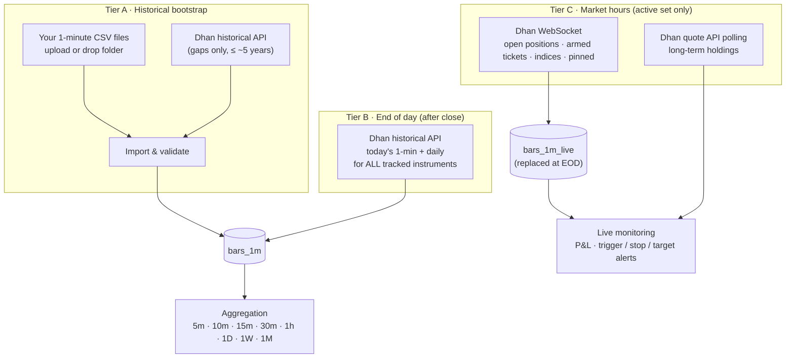

# 05 — Data & Brokers

## 1. Data sources (v1)

| Source | Role | Cost |
|--------|------|------|
| **Your CSV files (1-minute)** | Historical bootstrap and any bulk history you provide | ₹0 |
| **Dhan Data API** | The **only market-data API** in v1: instrument master, end-of-day 1-minute/daily fetch for tracked instruments, live feed for the active set, quotes for holdings | ₹499 + taxes / 30 days, on one account |
| **Dhan Trading API** | Funds, positions, holdings, trade history, ledger — every Dhan account | Free |
| NSE files (optional) | Free official bhavcopy / corporate actions / holidays for reconciliation | ₹0 |
| Upstox | Adapter kept for later (second broker / fallback); **disabled in v1** | — |

## 2. Three data tiers



- **Tier A** fills history once (and whenever you add instruments or files).
- **Tier B** keeps every tracked instrument complete each evening — the learning engine and nightly plan use only
  Tier A/B data.
- **Tier C** streams live data **only for what you are actively trading or holding**, keeping the system light.

## 3. CSV import (1-minute data)

### 3.1 How files arrive
- **Upload** in the Data → Import screen (multiple files / zip), or **drop** into the watched folder
  `data/inbox/` (mounted into `xd-worker`), or CLI `xd data import <path> --profile <name>`.
- One file per instrument (symbol from file name) or multi-instrument files (symbol column) — both supported.

### 3.2 Import profiles (column mapping)
Different CSV sources use different layouts; a saved **profile** describes yours once:

```yaml
csv_profiles:
  my_1min_files:
    delimiter: ","
    header: true
    symbol: { from: filename, pattern: "^(?<symbol>[A-Z0-9&-]+)_1min\\.csv$" }   # or { from: column, name: symbol }
    exchange: NSE
    columns: { timestamp: datetime, open: open, high: high, low: low, close: close, volume: volume, oi: null }
    timestamp: { format: "yyyy-MM-dd HH:mm:ss", timezone: Asia/Kolkata, label: bar_start }   # bar_start | bar_end
    prices: { adjusted: false }        # raw prices; system applies corporate-action adjustments
    session_filter: { from: "09:15", to: "15:29" }
```

Example accepted file (`TATASTEEL_1min.csv`):
```
datetime,open,high,low,close,volume
2026-10-05 09:15:00,152.10,152.60,151.95,152.40,412530
2026-10-05 09:16:00,152.40,152.55,152.20,152.30,198220
```

### 3.3 Import pipeline
1. **Detect** profile (or use the one specified); preview the first rows in the UI before committing.
2. **Map symbol** → master list; unknown symbols are listed for you to map or skip (never guessed).
3. **Validate** each row: timestamp parse, within session, OHLC consistency (`low ≤ open/close ≤ high`), no
   negative volume, no duplicate timestamps; bar-end labels shifted to bar-start.
4. **Upsert** into `market.bars_1m` with `source = csv`. Precedence on overlap (configurable): Dhan official >
   CSV > live; conflicts beyond tolerance are logged, not silently overwritten.
5. **Refresh aggregates** for the affected instrument/date range.
6. **Report**: rows imported/updated/rejected per file, coverage before/after, quality issues — stored as an
   import job you can review and undo (by job id).

Instruments in the files are auto-added to the **tracked** list (configurable), so they are kept up to date by
Tier B afterwards.

## 4. Aggregation to other timeframes

All timeframes are built from 1-minute bars — identical logic for CSV and Dhan data.

| Rule | Detail |
|------|--------|
| OHLCV | open = first, high = max, low = min, close = last, volume = sum, OI = last |
| Alignment | Intraday buckets anchored to the **09:15** session open: 15m = 09:15, 09:30…; 1h = 09:15–10:15 … 14:15–15:15, then 15:15–15:30 (partial, flagged) |
| Timeframes | 5m, 10m, 15m, 30m, 1h (and any custom minute size) · 1D · 1W · 1M |
| Daily bar | `daily_source: official` (Dhan daily candles, default when available) or `derived` (from 1-minute) — official open uses the pre-open auction price, so the two can differ slightly |
| Missing minutes | Bucket built from available minutes; completeness % stored; buckets below threshold flagged |
| Special sessions | Holidays skipped; special sessions (e.g. Muhurat) from the calendar |
| Implementation | TimescaleDB **continuous aggregates** (`time_bucket` with 09:15 origin) for intraday; 1D/1W/1M from daily table; refreshed after imports and after the EOD fetch; real-time aggregation combines materialised + newest rows |

## 5. Real-time data — the active set only

To keep the system fast and within limits, live data is streamed only for the **active set**:

| Member of active set | Why | Method |
|----------------------|-----|--------|
| Open intraday / swing positions (all accounts) | Live P&L, stop/target alerts | WebSocket (quote mode) |
| Today's armed plan tickets (until triggered/expired) | Trigger detection & alerts | WebSocket |
| Context indices (NIFTY 50, NIFTY BANK, INDIA VIX) | Market filter, live context | WebSocket |
| Pinned basket (optional) | Your live watch list | WebSocket (counts toward budget) |
| Long-term holdings | Valuation | Quote API polling (≤ 1,000 per request, every 5 min) |

- Dhan limits: up to 5 WebSocket connections × 5,000 instruments; our active set is typically < 100 → one
  connection. `live.max_ws_instruments` caps it (default 200).
- `xd-feed` builds **live 1-minute bars** in memory from ticks and persists them to `market.bars_1m_live`.
- At end of day, Tier B fetches the **official** 1-minute bars; live bars are reconciled and discarded.
- Subscriptions update automatically when a ticket arms, a position opens/closes, or holdings change.
- Runs 09:00–15:35 on trading days; auto-reconnect; gaps logged.

## 6. End-of-day fetch (Tier B)

Scheduled after close (default 15:50 IST) before the nightly pipeline:

1. Refresh Dhan token; refresh instrument master (new listings, lot sizes, expiries).
2. For every tracked instrument: fetch today's 1-minute candles and daily candle (throttled, chunked, resumable).
3. Detect gaps for recent days and backfill; corporate actions; calendar.
4. Quality checks (§9); reconcile with NSE files if enabled.
5. Refresh aggregates; then the nightly pipeline starts ([doc 03](03-target-architecture.md) §7).

Adding new tracked instruments triggers a backfill job (CSV first, then Dhan for gaps).

## 7. Broker abstraction

| Interface | Methods | v1 adapter |
|-----------|---------|-----------|
| `IMarketDataProvider` | instruments, intraday/daily history, quotes | Dhan |
| `ILiveFeed` | subscribe/unsubscribe, tick stream | Dhan WebSocket |
| `IAccountReader` | funds, positions, holdings, trades (history), ledger | Dhan |
| `ITokenProvider` | get, refresh, expiry | Dhan (API key & secret flow, 24 h tokens) |
| `IOrderExecutor` | place/modify/cancel (later phase) | — |
| `IFileImporter` | CSV profiles → bars | CSV |

Adding Upstox or another broker later = one adapter project + config. The instrument master maps each broker id
(Dhan `security_id` + segment) to a canonical symbol; mapping mismatches are quality issues, never guessed.

## 8. Accounts

Any number of accounts (all your own), each with **roles** — Data, Trading, Portfolio — as described in
[doc 04](04-accounts-access-and-operations.md) §1. The market-data jobs and live feed in this document always use
the **primary Data account** (with automatic failover to a standby Data account if configured). Trading accounts
have mode (`paper` / `manual_live`; automated modes later), risk profile, allowed styles/instruments and capital source. Nightly sync reads funds, positions, holdings, trade
history and ledger → feeds the **auto-journal** (fills matched to plan tickets) and **portfolio monitoring**
([doc 12](12-portfolio-monitoring.md)).

## 9. Storage

| Table | Type | Notes |
|-------|------|-------|
| `market.bars_1m` | Hypertable, compressed after 7 days | (instrument_id, ts), source = csv / dhan_eod |
| `market.bars_1m_live` | Hypertable, short retention | Live bars for the active set |
| `market.bars_5m … bars_1h` | Continuous aggregates | 09:15-anchored |
| `market.bars_1d` | Table | Official or derived (flagged) |
| `market.bars_1w`, `bars_1m_month` | Views/aggregates | From daily |
| `market.context_daily` | Table | Indices, VIX, breadth, regime |
| `data.import_profiles`, `data.import_jobs`, `data.import_issues` | Tables | CSV import config, history, rejected rows |
| Adjustment factors | Table | Research reads adjusted views; plans use raw prices |

Size: ~200 instruments × 8 years of 1-minute data ≈ 150 M rows → ~5–10 GB compressed.

## 10. Data quality

| Check | Action |
|-------|--------|
| Missing minutes (no halt) | Backfill from Dhan; flag if unresolved |
| Spike > X × ATR with reversal | Flag bad tick |
| OHLC inconsistency / duplicate timestamps (CSV) | Reject row, report |
| Timestamp label mismatch (bar end vs start) | Detected by session boundary check; profile fix suggested |
| CSV vs Dhan conflict beyond tolerance | Keep by precedence; log |
| Unapplied corporate action | Alert |
| Rename / merger / delisting | Master update; history linked |
| Circuit-locked days | Mark unfillable |

The nightly plan is not produced (fail closed) if index data fails or more than X% of tracked instruments fail;
individual instruments that fail validation are skipped by the scan (per-instrument fail-closed).

### 10b. Data quality window (validation workbench)

The **Data validation** service runs after every end-of-day fetch (and on demand) over the last N sessions
(default 5) of every tracked instrument:

| Check | How |
|-------|-----|
| Completeness | 375 one-minute bars per session; lists missing minutes |
| Bar sanity | low ≤ open/close ≤ high, positive prices |
| Duplicates | No repeated timestamps |
| Spikes | Move > k × median one-minute move and > 1% |
| **Aggregates vs 1-minute** | Every stored 5m/15m/30m/1h/1D bucket is recomputed from the 1-minute bars with an independent reference implementation and compared exactly (OHLC and volume) — catches aggregates not refreshed after late data |
| **Derived vs official daily** | 1D built from 1-minute vs the broker's official daily candle (±0.05% OHLC, ±1% volume) |
| Freshness | Data present up to the last trading day |

The **Data quality** screen lists every tracked instrument with status (pass / warning / fail), coverage, bars
checked, missing minutes, per-timeframe aggregate status, official-daily status and source (CSV / Dhan), plus a
data quality score. **Inspect** shows each check, a side-by-side table of stored vs recomputed buckets (with
"differences only"), the chart built from 1-minute data and the missing minutes. **Re-fetch** / **Refresh
aggregates** repair an instrument and re-validate it automatically; every run is kept in a history.

## 11. Biases avoided

Survivorship (historical index membership incl. delisted stocks), look-ahead (closed bars only; higher-TF from
last closed bar; point-in-time regime), selection (basket rules are dated; point-in-time membership available).
