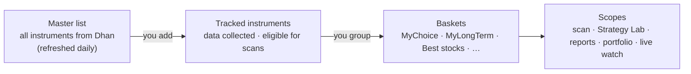

# 06 — Instruments & Baskets

How you choose **what the system works on** and how you **group and evaluate** it.

## 1. Concepts

| Concept | Meaning |
|---------|---------|
| **Master list** | Every instrument in Dhan's instrument (scrip) master — equities, indices, futures, options — refreshed nightly, mapped to canonical symbols ([doc 05](05-data-and-brokers.md)) |
| **Tracked instrument** | An instrument you've switched on. Only tracked instruments get historical data, end-of-day updates, scans and analytics |
| **Basket** | A named group of tracked instruments; an instrument can be in many baskets |
| **Scope** | Which basket(s) a strategy scan, a Strategy Lab test, a report or a portfolio view applies to |

## 2. Master list & tracked instruments

- **Search & add** from the Instruments screen: filter the master list by name, symbol, exchange, segment,
  instrument type, sector, index membership, F&O eligibility, price, turnover.
- **Bulk add** by pasting symbols, uploading a CSV list, or adding all members of an index/rule-based basket.
- **On activation** the system backfills history: first from your CSV files if present, then gaps from the
  Dhan historical API (1-minute up to ~5 years, daily since listing), and builds all timeframes.
- **On deactivation** collection stops; history is kept (re-activation only fills the gap).
- Status shown per instrument: data coverage (from/to), last update, quality issues, baskets, open positions.

| Field | Example |
|-------|---------|
| Canonical symbol | `NSE:TATASTEEL` |
| Broker ids | Dhan `security_id` + segment |
| Type / segment | EQ / NSE_EQ (also IDX, FUT, OPT) |
| Sector / industry | Metals |
| Lot size, tick size | 1 / 0.05 (futures: contract lot size) |
| Flags | F&O eligible, ASM/GSM, in ban period |
| Tracking | active since 2026-10-15; data from 2021-10-01 |

## 3. Baskets

### 3.1 Basket types

| Type | How membership is defined | Examples |
|------|---------------------------|----------|
| **Manual** | You add/remove instruments | MyChoice, MyLongTerm, Best stocks, Watchlist |
| **Rule-based (dynamic)** | A saved filter re-evaluated nightly | "F&O stocks with turnover > ₹50 Cr", "Nifty 50 members", "Sector = IT", "Near 52-week high" |
| **System** | Maintained automatically | Open positions, Holdings, Today's plan, Paused-cell instruments |

### 3.2 Basket attributes

| Attribute | Purpose |
|-----------|---------|
| Name, colour, description | Display |
| Purpose | `trading` · `long_term` · `watch` — drives defaults (e.g. long-term baskets excluded from intraday scans) |
| Allowed styles / sides | e.g. MyLongTerm: swing BUY only |
| Strategies in scope | Which strategies scan this basket (default: all enabled) |
| Risk profile override (optional) | e.g. smaller risk per trade for a speculative basket |
| Target weights (optional, long-term) | For allocation drift view in the portfolio |
| Membership history | Added / removed dates and notes — enables point-in-time evaluation |

### 3.3 How baskets are used

| Use | Example |
|-----|---------|
| **Scan scope** | Nightly plan scans "Best stocks" and "MyChoice" for intraday; "MyLongTerm" only for swing BUY |
| **Strategy Lab universe** | "Test VWAP_RSI_TREND on MyChoice, 2022–today" |
| **Reports lens** | Compare results of all baskets side by side |
| **Portfolio grouping** | Value, return and XIRR per basket ([doc 12](12-portfolio-monitoring.md)) |
| **Live watch** | Pin a basket to the live price panel (counts toward the live-feed budget, [doc 05](05-data-and-brokers.md) §5) |

## 4. Evaluation lenses — looking at results from different angles

Every analytic screen uses the same **lens + filters** model: pick the lens (how rows are grouped), then
filter by date range, source, account, style, strategy, timeframe, side, exit, regime, basket.

| Lens | Rows | Typical question |
|------|------|------------------|
| **All trades** | One summary + equity curve | "How is the whole system doing this quarter?" |
| **By basket** | One row per basket | "Is MyChoice better than Best stocks for intraday?" |
| **By instrument** | One row per symbol | "Which stocks consistently work / fail?" |
| **By individual trade** | One row per trade, drill to replay | "Why did this TATASTEEL trade lose?" |
| **By strategy / cell** | Strategy × TF × side × exit | "Which setups work in which basket?" |
| **By account** | One row per broker account | "How does each account perform?" |
| **By sector / regime / month** | Grouped rows | "Where and when does it work?" |

Lenses can be combined as a pivot (e.g. *basket × strategy* heatmap of expectancy, or *basket × month*
returns). Each basket row also shows a **buy-and-hold benchmark** (equal-weight basket return and Nifty 50
over the same period) so trading results are judged against simply holding the basket.

**Overlapping baskets:** an instrument in several baskets appears under each, so per-basket totals are not
additive — the UI says so. For additive totals (e.g. portfolio value) a position has one **portfolio bucket**
([doc 12](12-portfolio-monitoring.md) §5).

**Point-in-time vs current membership:** reports default to *current* membership; switch to *as-of*
membership to evaluate a basket exactly as it was composed on each trade date.

## 5. Data model

| Table | Key columns |
|-------|------------|
| `market.instruments` | id, canonical_symbol, type, segment, sector, lot_size, tick_size, flags, listed_on |
| `market.instrument_broker_ids` | instrument_id, broker, broker_id, segment |
| `catalog.tracked_instruments` | instrument_id, active, active_since, data_from, data_to, last_update |
| `catalog.baskets` | id, name, type (manual/rule/system), purpose, colour, settings (JSON), rule (JSON) |
| `catalog.basket_members` | basket_id, instrument_id, valid_from, valid_to, note, target_weight |

## 6. Screens

- **Instruments** — master-list search with facets; tracked list with coverage/quality/basket chips; bulk actions
  (track, untrack, add to basket, backfill).
- **Baskets** — list with key stats; editor (manual add/remove, drag & drop, rule builder with live preview);
  basket detail (members, performance by lens, benchmark, open positions).
