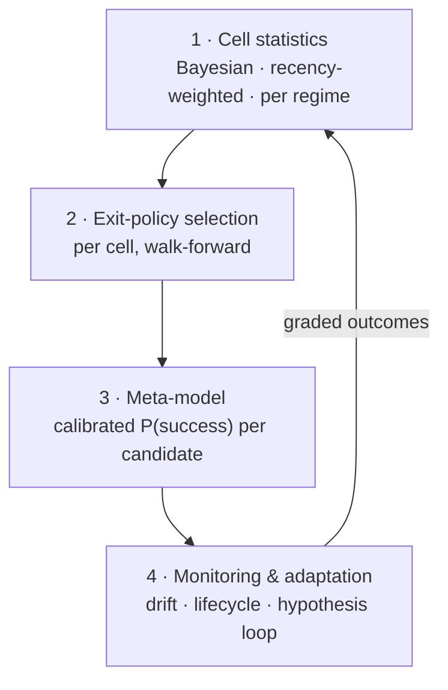
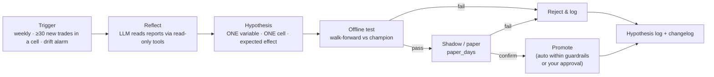
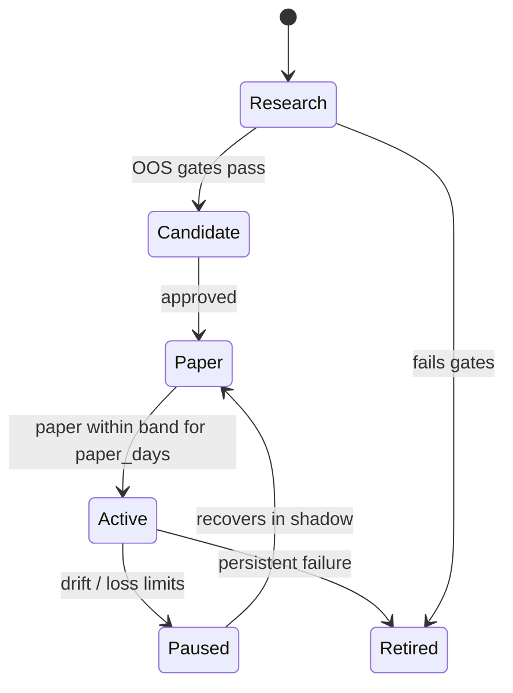
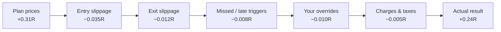
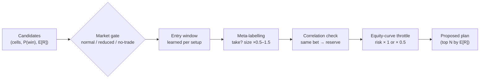

# 09 — Learning Engine

"Self-learning" = continuously re-measuring which setups, timeframes, sides and exits work in which market
conditions, and shifting recommendations accordingly — with guards against fooling itself.

## 1. Four layers



**Layer 1 — Cell statistics.** For each cell `(strategy, tf, side, style, exit_policy, regime)` and windows
(all / 250 days / 60 days): n, win rate, avg win/loss R, expectancy, profit factor, max drawdown, MAE/MFE
quantiles. Win rate uses a Beta prior **shrunk toward the parent group** when n is small; confidence = lower
bound of the credible interval; exponential recency weighting.

**Layer 2 — Exit selection.** See [doc 08](08-exits-and-risk.md) §3.

**Layer 3 — Meta-model (meta-labeling).**
- Labels: **triple barrier** — target, stop, time limit (session end / max hold).
- Model: gradient-boosted trees (ML.NET LightGBM, FastTree fallback) per style × side (strategy as feature),
  **isotonic (PAV) calibration**, per-prediction feature contributions + permutation importance; trained and
  scored in-process in .NET.
- Must beat baselines (logistic regression; cell stats only) out-of-sample, else not used.
- Top contributing features stored with each recommendation.

**Layer 4 — Monitoring & adaptation.**
- Regime-conditioned statistics.
- **Drift**: rolling expectancy below the backtest band for K checks ⇒ auto-pause; paused cells keep being
  shadow-graded and re-qualify automatically.
- **Champion/challenger** for models and parameters.
- **Learning changelog** for every automatic change, with evidence.

## 2. Validation: purged walk-forward

```
|---- train (3y) ----|-gap-|-- test (3m) --|
       |---- train -------------|-gap-|-- test --|
```
Only test windows count. Gap ≥ max holding (5 sessions). Tuning only inside train windows.

## 3. Daily feedback loop

1. Grade yesterday's primary, reserve and rejected items against actual data.
2. Attach real fills (auto-journal) → measure live vs paper slippage; grade on executed prices (§9).
3. Append outcomes with decision-time feature snapshots.
4. Update cell stats; run drift and lesson monitors (§10).
5. Weekly: retrain, recalibrate, challenger test.

## 4. Outputs per candidate

| Output | Meaning |
|--------|---------|
| `p_win` | Calibrated probability of target before stop/time limit |
| `exp_R` / `exp_R_lower` | Expected R after costs / conservative bound (used for ranking) |
| `exit_policy` | Chosen policy with fitted levels |
| `expected_hold` | Typical bars/sessions to resolution |
| `confidence` | Sample size, calibration, regime match |
| `reasons` | Top features + cell statistics in plain text |

## 5. Hypothesis loop (one variable at a time)



Hypotheses can come from the LLM, a parameter grid, or you. Live strategies are never edited directly by
an LLM. Record example:

```json
{"id":"H-2026-10-18-01","cell":"ORB|15m|BUY|INTRADAY|*","variable":"exits.FIXED_RR.rr","from":2.0,"to":2.5,
 "rationale":"Median MFE 2.7R over 120 OOS trades","status":"shadow",
 "backtest":{"oos_trades":212,"exp_R_champion":0.21,"exp_R_challenger":0.26}}
```

## 6. Overfitting guards

1. Out-of-sample only for decisions.
2. Minimum 30 OOS trades per cell.
3. ≤ 4 parameters per strategy; coarse grids; plateaus.
4. Multiple-testing adjustment (deflated Sharpe, stricter thresholds as tests grow).
5. Costs always on.
6. Monte Carlo trade reshuffling for drawdown expectations.
7. Paper stage before live.
8. Random-entry baseline with identical exits.

## 7. Cell lifecycle



Default gates: OOS trades ≥ 30 · expectancy ≥ +0.15R · profit factor ≥ 1.2 · positive in ≥ 60% of folds ·
max drawdown ≤ 10R · calibration error ≤ 5 pp.

## 8. Compute (M4 Pro, 48 GB)

Full walk-forward (~20 strategies × 6 TFs × 2 sides × ~8 exits × 200 symbols × 5 years): a few hours in
parallel .NET workers, monthly/weekends. Nightly incremental: minutes. Model training: minutes.

## 9. Execution feedback: learning from what actually happened

The system learns from **your real fills**, not only from chart prices. Every graded trade carries both the plan
prices and the executed prices, and the difference is decomposed every week:



| Feedback | What the system changes automatically |
|----------|---------------------------------------|
| Labels use real fills | Outcomes, R-multiples and MAE/MFE are computed from executed prices — the model learns what is achievable |
| Slippage per liquidity bucket | Re-estimated weekly from your fills; used in every backtest, experiment and E[R] |
| Missed triggers (touched, not filled) | Trigger buffer and order type (market vs limit-with-buffer) per instrument |
| Partial fills / broker rejections | Lower the cell's **capacity score**; selection prefers tickets that can actually be filled |
| Your overrides | Graded against the system's proposal (Reports → Decisions); feeds the autonomy recommendation (§13) |

A setup that is profitable on plan prices but not after execution is treated as **not profitable**.

## 10. Lessons: problem → diagnosis → fix → result

When a monitor fires, the system opens a **lesson** — a record of what went wrong and what was done about it.
Monitors: drawdown beyond the Monte Carlo band, drift (CUSUM on expectancy), calibration error, execution gap,
decision drag, tail losses, data-quality failures.

| Category | Typical diagnosis | Typical fix |
|----------|-------------------|-------------|
| Regime | Setup fails in one volatility/trend regime | Regime gate for that cell |
| Exits | MFE after stop is high (stops inside noise); targets rarely hit | Stop/target multiple (one variable) |
| Execution | Fills worse than plan on illiquid names or at the open | Liquidity filter, order type, entry window |
| Calibration | Predicted win rate above actual | Recalibration (PAV), stronger shrinkage prior |
| Decisions | Your rejections or modifications cost R | Auto-approval rule (autonomy) |
| Drift | Edge decays over months | Pause / retire; promote a shadow challenger |
| Events | Gaps through stops around results | Event filter, gap-aware sizing |
| Data | Bad bars caused false signals | Repair, fail-closed gate |

```json
{"id":"L1","category":"Regime","detected":"2025-11-10","cell":"ORB|15m|*|INTRADAY|*",
 "problem":"Win rate 47% → 29% over 38 trades with INDIA VIX > 18 (−9.4R)",
 "diagnosis":"64% of losers hit the stop within 15 minutes (false breakouts in volatile opens)",
 "fix":{"variable":"regime_gate.vix_max","from":null,"to":18,"how":"auto","evidence":"7/8 folds, +0.38R"},
 "result":{"metric":"exp_R","before":-0.21,"after":0.17,"trades_after":60},"status":"resolved"}
```

Lessons are kept forever and shown on the Learning screen with a before/after chart, the walk-forward evidence
and two actions: **Revert** and **Re-run with a different value** (opens §12 pre-filled).

## 11. Making learning visible (Learning screen)

| View | Question it answers |
|------|---------------------|
| **Journey** | Is the system improving? Weekly live expectancy vs a **frozen copy of last year's model** (the counterfactual) vs plan prices; red bands from problem to fix; pins for lessons; cumulative R uplift; model versions |
| **Learning health** | One 0–100 score from data quality, calibration, execution, stability and evidence (sample size) — and which part is weakest |
| **Lessons** | What went wrong, what was done, did it work (§10) |
| **Plan vs actual** | Where the edge is lost between plan and fills (§9) |
| **Setups (cells)** | Expectancy heatmap by setup × month; lifecycle funnel (candidate → shadow → probation → active → paused → retired) |
| **Tweak & re-run** | Change a learning knob and replay (§12) |
| **Autonomy** | How much the system decides alone; change log with revert (§13) |

The frozen-model line is what makes progress honest: improvement is measured against "what would have happened
if the system had stopped learning", on the same days and instruments.

## 12. Tweak & re-run (experiments)

You can change any learning knob and replay the last 12 months walk-forward before anything goes live.

| Knob | Current (demo) | Effect |
|------|---------|--------|
| History window | 18 months | How much history each cell learns from |
| Recency half-life | 120 days | Older trades count less; shorter adapts faster but is noisier |
| Min trades to activate a cell | 30 | Evidence needed before a setup can trade |
| Shrinkage prior | 35 trades | Pulls small samples toward the strategy average |
| Breakout VIX gate | 18 (or off) | Regime gate for breakout cells |
| Intraday stop | 1.2 × ATR | Initial stop for 5m/15m setups |
| Selection threshold | P(win) ≥ 52% | Minimum calibrated probability to enter the plan |
| Slippage model | 8 bps | Cost assumed in backtests |

Rules that keep experiments honest:
1. **Same trades, same days** (common random numbers): candidate and current model differ only by your change.
2. **12 out-of-sample folds**; the verdict needs ≥ 8 folds better.
3. **Judged after the expected live gap**: a cheaper slippage model cannot "win".
4. **Total R matters**: higher expectancy on far fewer trades (total R/year down > 10%) is not "better".
5. **Multiple-testing guard**: the required improvement rises with the number of experiments in 30 days
   (`0.02R + 0.006R × √trials`).
6. Next step after "better" is **shadow** (paper alongside live for 30 trades); **Apply** needs your password,
   is audited, and is monitored for 60 trades with **automatic rollback** if live results fall below the old version.

## 13. Autonomy: less intervention, same control

| Level | Plan tickets | Learning changes | Always asks you |
|-------|--------------|------------------|-----------------|
| **Advisory** | You approve every ticket | All wait for you | — |
| **Supervised** (default) | Tickets with P(win) ≥ threshold (default 58%) **and every pre-trade check passing** are auto-approved by the pre-open service at the cutoff; you review only the rest | Pausing cells, exit re-selection, recalibration, regime gates applied automatically within guardrails | Risk increases, new strategies, live execution, accounts |
| **Autonomous within limits** | All tickets inside risk limits are armed; daily digest with veto until the cutoff | Shadow-tested challengers promoted automatically | Same as above |

Guardrails at every level: one variable per change, out-of-sample proof, a weekly cap on automatic changes
(default 3; more wait for you), 60-trade monitoring with automatic rollback, every change in the change log with
one-click **Revert**, and password re-entry to raise the autonomy level. Auto-approved tickets are marked on the
plan and in the audit log; the Decisions report compares them with your manual decisions so the threshold can
itself be tuned from evidence.

## 14. Smart rules: from learned signals to a safer plan

Five learned rules sit between the scanner's candidates and tomorrow's plan, plus two feedback features. All run
in the nightly pipeline without you; their state is shown on Plan review and **Learning → Smart rules**, and
switching one off needs your password.



| # | Rule | How it is learned | What it changes |
|---|------|-------------------|-----------------|
| 1 | **Grade on fills** (§9) | Executed prices from the broker (auto-journal); simulated fills in paper mode | Every R, label and statistic; "R plan" kept alongside for the execution gap |
| 2 | **Frozen-model benchmark** (§11) | Last year's model replayed on the same days | Progress line on Learning, Today and the weekly digest |
| 3 | **Lessons + automatic rollback** (§10, §12) | Monitors; 60-trade monitoring after every change | A change that does worse live is rolled back without you (example L9) |
| 4 | **Equity-curve throttle** | The system's own taken trades: equity vs its N-trade average (default 20) | Risk × `cut` (default 0.5) while below; back to × 1 when above. Demo history: max drawdown −9.3R → −6.0R for 10% less total R |
| 5 | **Market gate (no-trade days)** | Outcome of past trades by INDIA VIX level, breadth (% of tracked stocks above 20-DMA) and high-impact events (RBI, Budget) | *Reduced*: half the tickets, risk × 0.75 · *No-trade*: no tickets (best candidates kept on reserve for reference) |
| 6 | **Meta-labelling** | Second ML.NET model on graded trades: features of the signal → "was it worth taking?" | Score < threshold (default 50%) → reserve; otherwise size × 0.5–1.5 |
| 7 | **Learned entry windows** | Walk-forward expectancy by entry hour per setup (backtest, thousands of trades) | The ticket's validity window becomes the best hour (e.g. ORB 09:15–10:00) |
| 8 | **Correlation-aware plan** | 60-day return correlation between tickets, open trades and holdings across accounts | Correlation > limit (default 0.6) with a better ticket or open trade → reserve ("same bet"); pre-trade checklist warns |
| 9 | **Automatic loss tags** | Rules on MAE/MFE, entry time, regime, slippage, event calendar | Tags on every loss (gap through stop, gave back open profit, against regime, late entry, high slippage, news/results, normal variance); a growing tag opens a lesson |
| 10 | **Weekly learning digest** | Built by the weekly retrain service | One summary: progress vs frozen model, what changed automatically, what needs you, what is being watched, why trades lost, focus for next week |

Honesty rules for these features: each rule's evidence (trade counts, R by bucket) is shown next to it; a rule
that would remove more than half of all trades, or whose "skipped" trades are not worse than the "taken" ones over
the last 100 trades, is flagged for review instead of being trusted blindly.
