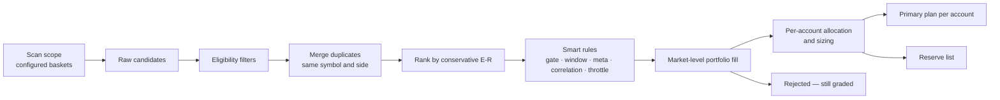

# 10 — Trade Selection & Allocation

From dozens of candidates to the best `max_new_entries_per_day` (e.g. 3), fitted to each account.

## 1. Pipeline



**Scan scope:** candidates come only from instruments in the baskets listed in `scan_scope`
([doc 06](06-instruments-and-baskets.md)), each with its allowed styles/sides (e.g. MyLongTerm → swing BUY only).
Every candidate carries its basket(s) so results can later be evaluated by basket.

### Smart rules (learned, [doc 09](09-learning-engine.md) §14)

| Rule | Effect on the plan |
|------|--------------------|
| Market gate | *Normal* · *reduced* (half the tickets, risk × 0.75) · *no-trade* (no tickets; candidates kept on reserve) |
| Learned entry window | Intraday ticket validity window = the setup's best entry hour from walk-forward results |
| Meta-labelling | Score < `meta.min_take` → reserve; otherwise size × 0.5–1.5 |
| Correlation | 60-day correlation > `corr.max` with a better ticket or an open trade → reserve ("same bet") |
| Equity-curve throttle | Risk × `throttle.cut` while the system's equity is below its N-trade average |

Filtered tickets stay on the reserve list with the reason, and are graded like every other candidate.

## 2. Eligibility filters

| Filter | Default |
|--------|---------|
| Cell status ACTIVE | required |
| Min calibrated P(win) | 0.45 (for ~1:2 exits) |
| Min conservative expectancy | +0.10R |
| Min achievable R:R before obstacle | 1.5 |
| Min OOS sample | 30 |
| Max costs | 0.10R |
| Liquidity / events / F&O ban / surveillance | excluded |

## 3. Merge duplicates

Group by (symbol, side); keep the highest conservative-E[R] ticket; add a confluence bonus when independent
strategies/timeframes agree. Opposite sides for the same symbol: keep the stronger, or drop both if close.

## 4. Ranking

```
rank_score = exp_R_lower + w_conf·confluence + w_regime·regime_fit
           − w_corr·correlation_with_book − w_event·event_risk
```

## 5. Portfolio fill (greedy, constraints checked after each addition)

| Constraint | Default |
|-----------|---------|
| New entries per day | 3 |
| Open positions (incl. carried swing) | 5 |
| Total open risk | 3% |
| Per sector | 2 |
| Pair correlation (60-day) | ≤ 0.70 |
| Intraday / swing mix | 2 / 2 |
| Net long / short risk | 2% / 2% |
| One position per symbol | yes |
| Per basket (optional) | e.g. max 2 from MyChoice |
| Already held long-term | Skip SELL setups on instruments in your holdings (configurable) |

`count_entries_on: trigger` (default): the plan may list up to `max_plan_items` (e.g. 5) conditional tickets;
once 3 trigger, the rest are cancelled. `plan` mode limits the plan itself to 3.

## 6. Per-account allocation

1. Account sync provides funds, open positions and today's trades.
2. For each account: filter by allowed styles/instruments, drop symbols already held, apply the account's risk
   profile, size from its capital and lot sizes.
3. Mode `replicate`: every eligible account gets the same top tickets, sized individually.
   Mode `distribute`: ranked tickets are spread across accounts, no symbol duplicated.
4. Cross-account limits: max accounts per symbol, max total risk across all accounts.

## 6b. Pre-trade checklist

Each proposed ticket carries automatic checks — data quality, conflict with your holdings (e.g. a SELL on a stock
you hold long-term), sector exposure, **correlation with open trades and approved tickets**, results within 3 days — shown on the ticket in Plan review
([doc 15](15-smart-insights-and-automation.md) §2). A failed check needs an explicit confirmation to approve.

## 6c. Human review

The output of this pipeline is a **proposed** plan. You approve, modify or reject each ticket before the review
cutoff; only approved tickets are armed at the pre-open check ([doc 04](04-accounts-access-and-operations.md) §4.2).
Allocation goes only to accounts with the **Trading** role.

## 7. Day-level guards

Daily loss limit ⇒ cancel remaining tickets; the **market gate** (learned from VIX, breadth and the event
calendar) reduces or cancels the whole plan; the **equity-curve throttle** halves risk while the system is cold. Optional **pre-open check** (default 09:10, after the review cutoff and NSE pre-open price discovery): gap beyond
trigger or > `gap_invalidate_atr` ⇒ invalidate and promote from reserve.

## 8. Proving the selector (and your overrides)

Rejected candidates are graded nightly. Reports compare primary vs reserve vs rejected and "top-1/3/5/all"
curves — showing whether ranking adds value and what `max_new_entries_per_day` should be.
Your decisions are graded too: approved vs rejected vs lapsed vs modified tickets, compared with what the
system proposed.
