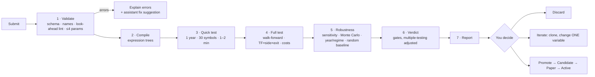

# 11 — Strategy Lab

Submit your own strategy rules at any time; the system validates, tests and reports a verdict — no code
changes, no restart.

## 1. Ways to submit

| Channel | How |
|---------|-----|
| **Rules editor** | React page with Monaco YAML editor, live JSON-Schema validation and autocomplete |
| **Form builder** | Pick indicators, conditions, stops, exits from menus → generates the same YAML |
| **Plain English** | Describe the idea to the assistant → it drafts YAML → **you confirm** |
| **Inbox folder** | Drop `*.yaml` into `strategies/inbox/` (watched) or use `xd strategy test file.yaml` |
| **C# plugin** (advanced) | Implement `IStrategy` for logic the DSL can't express; compiled and run in `xd-sandbox` (no network, resource limits) |

All channels produce one validated strategy spec, run by the same engine as built-in strategies.

## 2. Rules language (DSL)

Declarative, safe (parsed and compiled to expression trees, never `eval`), look-ahead-proof (only closed bars;
higher timeframes = last closed bar).

> "Intraday: after 9:45 buy when a 15-min candle closes above VWAP with RSI(14) above 55 and 1-hour EMA20
> above EMA50. Stop below last swing low. Target 1:2, or trail after 1R. Exit by 15:15. Mirror for shorts.
> Test 2022 to today on my MyChoice and Best stocks baskets."

```yaml
strategy:
  id: VWAP_RSI_TREND
  version: 1
  style: intraday
  timeframes: [15m]
  sides: [BUY, SELL]              # SELL auto-mirrored unless a `sell:` block is given
  universe: { baskets: [MyChoice, "Best stocks"] }   # or instruments: [...] or a rule-based basket
  params: { rsi_len: 14, rsi_min: 55, swing_lookback: 5 }
  setup:
    all:
      - time >= "09:45"
      - tf("1h").ema(20) > tf("1h").ema(50)
      - rsi(rsi_len) > rsi_min
  trigger:
    all:
      - crosses_above(close, vwap)
  entry: { type: at_close }       # at_close | stop_above_high | limit_pullback
  stop:  { type: swing_low, lookback: swing_lookback, buffer_atr: 0.1 }
  exits:
    - { policy: FIXED_RR, rr: [2.0] }
    - { policy: PARTIAL_TRAIL, book_pct: 50, t1_rr: 1.0, trail: { type: ATR, mult: 2.0 } }
  time_rules: { last_entry: "14:30", square_off: "15:15" }
  filters: [not_event_day, min_turnover]

test:
  period: { from: 2022-01-01, to: today }
  method: walk_forward            # walk_forward | simple_split | full_period (exploration only)
  compare_with: [baseline_random, ORB]
  robustness: { param_sensitivity: true, monte_carlo: 1000, by_year: true, by_regime: true }
```

| Building blocks | Examples |
|-----------------|----------|
| Price & bars | `open high low close volume`, `close[1]`, `prev_day.high`, `today.open`, `or_high(15)` |
| Indicators | `sma ema rsi atr adx macd bbands vwap supertrend highest lowest rel_volume` |
| Multi-timeframe | `tf("1h").ema(50)`, `tf("1D").close` |
| Conditions | `crosses_above/below`, comparisons, `between`, `rising/falling(x,n)`, `all/any/not` |
| Patterns | `inside_bar`, `nr(7)`, `gap_pct`, `engulfing`, `pivot_high/low(n)` |
| Context | `regime()`, `index.trend`, `vix_pct`, `sector_rs(n)`, `day_of_week`, `is_expiry_day` |
| Stops | `fixed_pct`, `atr_mult`, `swing_low/high`, `bar_low/high`, `or_opposite`, `level` |
| Exits | Any policy from [doc 08](08-exits-and-risk.md) |

## 3. Pipeline



Runs as Hangfire jobs in `xd-worker`; progress streamed to React via SignalR; indicator results cached.
Full walk-forward: ~10–60 min depending on universe, timeframes and exits.

## 4. Report

| Section | Content |
|---------|---------|
| Verdict | PASS / MARGINAL / FAIL with exact reasons (each gate ✓/✗) |
| KPIs | Trades, win rate, avg win/loss R, expectancy, profit factor, max drawdown, net ₹ after costs |
| Best cells | TF × side × exit with OOS expectancy and sample size |
| By basket / instrument | Same metrics per basket and per instrument — where the idea works and where it doesn't |
| Charts | Equity & drawdown, R histogram, MAE/MFE, by year, by regime, parameter heatmap, Monte Carlo fan |
| Comparisons | Random-entry baseline, existing strategies, index buy-and-hold |
| Warnings | Low samples, cost sensitivity, concentration, unstable parameters |
| Trades | Full list with chart replay |
| Summary | Plain English from the assistant, using report numbers only |

## 5. Guarding against "test until it passes"

- Every variant recorded in a per-family **test ledger**; thresholds tighten as variants grow.
- Only walk-forward OOS can PASS; `full_period` is exploration-only.
- Promotion always passes through paper trading.
- The assistant can run tests but **cannot promote**.

## 6. Storage & reproducibility

`lab.strategies` / `lab.strategy_versions` (YAML + hash), `lab.lab_runs` (data snapshot, config version,
engine version), `lab.lab_results`, `lab.test_ledger`. Strategy files also kept in git under `strategies/`.
