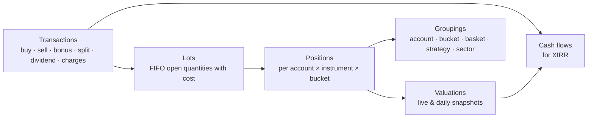

# 12 — Portfolio Monitoring

Add your broker accounts and monitor **every trade and holding**: when it was added, current value, return %,
XIRR, and totals — grouped by basket, account, strategy or sector.

## 1. Data sources

| Source | What it provides | When |
|--------|------------------|------|
| Dhan **holdings** & **positions** APIs | Current holdings (delivery) and open positions (intraday/F&O) | On sync (nightly + on demand + market hours) |
| Dhan **trade history** API | Every trade with date/time, price, quantity, side and full charge breakdown (paginated by date range) | Nightly incremental; one-time backfill |
| Dhan **ledger** API | Cash credits/debits (funds added/withdrawn, dividends, charges) | Nightly |
| **CSV import** | Older trades (before API history / other brokers), contract-note or tradebook exports | On demand |
| **Manual entry** | Corrections, off-platform transactions | On demand |
| Corporate actions | Splits, bonuses, dividends | Nightly |
| Prices | Live quotes for open trades & holdings; EOD close for valuation ([doc 05](05-data-and-brokers.md) §5) | Market hours / EOD |

## 2. Domain model



- **Transaction** — immutable record (source: broker / CSV / manual; charges attached).
- **Lot** — each buy creates a lot; sells consume lots **FIFO** (matches Indian practice) → realised P&L per lot.
- **Position** — open quantity, average cost (incl. charges), first-added date, linked plan ticket (if any).
- **Valuation** — market value at a time; a daily snapshot after close builds the portfolio value history.
- **Cash flow** — dated money in/out used for XIRR.

## 3. Metrics

### Per position / trade
| Metric | Definition |
|--------|------------|
| Added on | Date/time of first buy (and of each add) |
| Days held | Calendar days since first buy (or until exit) |
| Quantity, avg cost | Open quantity; average cost including charges |
| LTP, market value | Live or last close price × quantity |
| Unrealised P&L (₹, %) | Market value − remaining cost |
| Realised P&L (₹) | From FIFO-closed lots, net of charges |
| Total return % | (Realised + unrealised + dividends) / total invested |
| Day change (₹, %) | vs previous close |
| **XIRR** | Annualised return from dated cash flows (§4) |
| CAGR | For holdings > 1 year |
| Weight % | Share of portfolio (or bucket) value |
| System trade info | Strategy, cell, entry plan, R-multiple, stop/target distance (if from a plan ticket) |

### Per group (basket / bucket / account / strategy / sector / total)
Invested · current value · realised · unrealised · total return % · **XIRR** · day change · number of open
positions · win rate & expectancy of closed trades · **benchmark XIRR** (same cash flows invested in Nifty 50)
and **alpha** (XIRR − benchmark XIRR) · max drawdown of the group's value history.

## 4. XIRR

Cash flows: each buy = −(amount + charges); each sell = +(amount − charges); dividends = +amount; plus the
**terminal value** = +current market value on the valuation date. XIRR is the rate *r* where

```
Σ  CFᵢ / (1 + r)^((dᵢ − d₀) / 365)  =  0
```

- Solved with Newton–Raphson, falling back to bisection if it doesn't converge (Excel-compatible results).
- Computed for any set of cash flows: one trade, a position, a bucket, a basket, an account, the total.
- **Short periods:** annualising a few days' return gives misleading numbers; below `min_days_for_xirr`
  (default 30) the UI shows absolute return and marks XIRR as "short period".
- Example: buy ₹1,00,000 on 1 Jan; add ₹50,000 on 1 Apr; value ₹1,72,000 on 31 Dec → XIRR ≈ 16.1%
  (absolute return 14.7%).

## 5. Grouping: baskets vs portfolio buckets

| Concept | Overlap | Use |
|---------|---------|-----|
| **Instrument baskets** ([doc 06](06-instruments-and-baskets.md)) | An instrument can be in many baskets | Analysis lens — totals not additive |
| **Portfolio bucket** | Each position belongs to exactly **one** bucket | Additive view — bucket totals sum to the portfolio |

- A position's bucket defaults to the instrument's primary basket (e.g. MyLongTerm) and can be overridden per
  trade — e.g. the same stock bought for long-term (bucket *MyLongTerm*) and for a swing trade (bucket *Trading*)
  is tracked as two positions with separate lots, returns and XIRR.
- System-plan trades default to bucket *Trading* (configurable).

Views: **tree** — Total → Account → Bucket → Position → Lots/Transactions; **pivot** — rows by bucket,
basket, account, strategy or sector with the metrics in §3.

## 6. Live updates

| What | Update method | Frequency |
|------|---------------|-----------|
| Open intraday & swing positions, armed tickets | Dhan WebSocket (active set) | Real-time |
| Long-term holdings | Dhan quote API (up to 1,000 instruments/request) | Every `holdings_refresh_minutes` (default 5) |
| Portfolio snapshot | EOD official close | Daily after close |

The React Portfolio screen receives updates via SignalR; values recalculate incrementally.

## 7. Alerts

Price reaches a plan's stop/target level · swing position at max holding (5 sessions) · results date within
N days for a holding · position weight > `max_position_weight_pct` · bucket drawdown > threshold · large day
move on a holding · data or token issue for an account.

## 8. Link to the trading system

- Positions created from plan tickets keep `plan_item_id` → strategy, cell, R-multiple and grading.
- Trades not matching any plan are tagged **discretionary**; their results are reported separately (and in the
  discipline report).
- Long-term holdings are not managed by the system's exits unless you assign a strategy/exit to them.

## 9. Data model (`portfolio` schema)

| Table | Key columns |
|-------|------------|
| `accounts` (in `trading`) | id, broker, mode, profile |
| `transactions` | id, account_id, instrument_id, type, ts, qty, price, charges (JSON), source, external_id, bucket_id, plan_item_id |
| `lots` | id, transaction_id, open_qty, cost_per_unit, opened_at, closed_at |
| `lot_closures` | lot_id, sell_transaction_id, qty, realised_pnl |
| `positions` | account_id, instrument_id, bucket_id, qty, avg_cost, first_added_at, status |
| `buckets` | id, name, default_basket_id |
| `cash_flows` | id, account_id, ts, amount, kind (deposit/withdrawal/dividend/charge/trade) |
| `valuations_daily` | date, account_id, bucket_id, position_id, market_value, invested, realised, unrealised |
| `corporate_action_adjustments` | instrument_id, ex_date, ratio, applied_to_lots |

## 10. Portfolio screen (React)

- **Account tiles (one per Portfolio account + "All accounts"):** value, unrealised P&L (₹, %), day change, XIRR,
  open positions, realised P&L, top holding and its weight, number of open action items — click to focus the
  whole page on that account.
- **Action center:** positions that need a decision, per account — below cost, large gain, overweight, sector
  concentration, max holding exceeded, results due, long-term soon, lagging Nifty, not in a basket — with
  Open / Set alert / Add to basket / Snooze / Done ([doc 15](15-smart-insights-and-automation.md) §3).
- **Header tiles:** total value · invested · total P&L (₹, %) · **XIRR** · day change · benchmark XIRR / alpha.
- **Group by:** Bucket · Basket · Account · Strategy · Sector · None — with tree-grid (expand to lots and
  transactions) and column chooser.
- **Charts:** allocation by group, sector exposure stacked by account, portfolio value vs the same cash flows in
  Nifty 50, XIRR by group.
- **Price alerts:** create from the Action center or a position; evaluated by the services; list in an Alerts panel.
- **Position drawer:** transaction timeline, price chart with buy/sell markers, lots, alerts, linked plan ticket.
- **Filters:** date range (for realised results), account, bucket, basket, status (open/closed), source.
- **Exports:** CSV/Excel of positions, transactions and realised P&L.

Out of scope for now: tax reports (STCG/LTCG statements) — the lot data supports adding them later.
