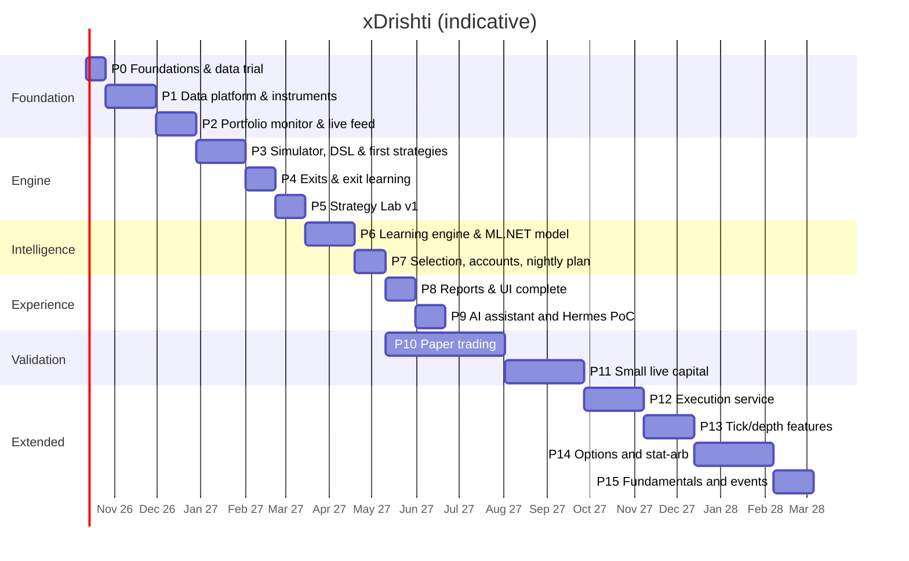

# 18 — Roadmap

Part-time (~10–12 h/week) with an AI coding assistant. Each phase ends with an exit criterion. Portfolio
monitoring comes early because it is useful on its own while the trading engine is being built.

| Phase | Deliverables | Exit criterion |
|-------|--------------|----------------|
| **P0 Foundations** (2w) | Answer open questions (doc 01 §5); review the **clickable prototype** (`prototype/`); Podman machine (libkrun); repo skeleton: .NET solution, React (Vite) app, `compose.yaml` with `xd-db`; Keychain→secrets script; Dhan trial (Data API, API key/secret token flow, 1-minute history for 20 symbols); **CSV profile for your files** + sample import; `xd-llm` GPU benchmark; ML.NET spike on linux/arm64 | Data-quality note written; stack starts with one command |
| **P1 Data platform & instruments** (5w) | Dhan adapter (instrument master, history, accounts); **CSV import** (profiles, preview, validation, upsert, undo, folder watch, CLI); Timescale hypertables + continuous aggregates (5m…1h, 1D/1W/1M); corporate actions; calendar; context data; **master list, tracked instruments, baskets** (manual, rule-based, system); EOD fetch + backfill jobs; quality checks; **Data quality window** (validation service, stored-vs-recomputed aggregates, repair); React shell with **login (password; re-entry for sensitive actions), Accounts (list/detail tabs, role matrix, risk profiles, wizard), Services screen with schedule configuration & dependency checks**, Instruments, Baskets and Data/Import screens; commands/desired-state + audit | Your CSV history imported; 5 unattended EOD fetches; all timeframes match a hand-check on 10 samples |
| **P2 Portfolio monitor & live feed** (4w) | Account sync (holdings, positions, trade history, ledger); transactions, FIFO lots, positions, buckets; CSV/manual trade import; **XIRR**, returns, benchmark; daily valuations; `xd-feed` live feed for the active set + quote polling for holdings; Portfolio screen (per-account tiles, **Action center**, price alerts, group by bucket/basket/account/sector, tree-grid, charts) | Portfolio values and XIRR match a spreadsheet check for 3 accounts/buckets; live P&L updates during market hours |
| **P3 Simulator, DSL & first strategies** (5w) | Streaming indicators/features; DSL parser → expression trees + look-ahead lint; event-driven simulator (conditional entries, stops, square-off, max hold, gaps, costs, slippage, MAE/MFE); `ORB`, `VWAP_PULLBACK`, `BASE_BREAKOUT`; scans scoped by basket | 20 random trades hand-verified against charts |
| **P4 Exits & exit learning** (3w) | All exit policies incl. pyramiding; same-entries comparison; per-cell exit choice (walk-forward); MAE/MFE diagnostics | Chosen exits stable across folds |
| **P5 Strategy Lab v1** (3w) | Lab API + Hangfire runs + SignalR progress; verdict & report; test ledger; `xd` CLI; Strategy Lab page (Monaco + schema); basket as test universe; `xd-sandbox` for C# plugins | 3 of your own ideas tested end-to-end without code changes |
| **P6 Learning engine & ML.NET model** (5w) | Regime labels; cell stats (Bayesian, recency); triple-barrier labels; ML.NET LightGBM/FastTree + PAV calibration + feature contributions; model registry; drift, lifecycle, changelog, hypothesis loop; **lessons** (monitors → problem/fix/result), **experiments** (tweak & re-run replay with honest comparison rules), frozen-model counterfactual; **meta-labelling model, learned entry windows, automatic loss tags**; remaining strategies | Meta-model beats baselines OOS; calibration error ≤ 5 pp; a knob change can be replayed and compared in < 10 min |
| **P7 Selection, accounts & nightly plan** (3w) | Filters, merge, ranking, portfolio fill; per-account allocation (Trading-role accounts); **plan review & approval workflow with pre-trade checklist, suggestions inbox, review cutoff**; auto-journal; grading (primary/reserve/rejected); pre-open check; **autonomy levels with auto-approval at the cutoff**; **smart rules in the nightly plan** (market gate, equity-curve throttle, correlation-aware selection); **weekly learning digest**; fail-closed nightly pipeline; plan tickets join the live active set; **start depth recording** | Plans published 10 consecutive sessions unattended |
| **P8 Reports & UI** (3w) | All screens & reports: **Learning screen** (journey, lessons, plan vs actual, setups, tweak & re-run, autonomy), Overview with auto-insights, multi-basket comparison, pivot builder, lenses, filters, drill-down, exports, PWA; responsive 360 px → 4K | "What works, in which basket, on which TF, with which exit" answered in < 2 min |
| **P9 AI assistant** (3w) | `xd-llm`, `xd-mcp`, assistant endpoint & chat; briefing; data Q&A (incl. portfolio & baskets); strategy drafting; eval set; Hermes PoC (doc 14 §6) | Eval set passes; Hermes adopt/reject decided |
| **P10 Paper trading** (≥ 12w, from P7) | Follow plans on paper/minimal size; weekly review; config changes only via hypothesis loop | ≥ 60 graded trades; positive expectancy after costs within backtest band; drawdown within Monte Carlo 90th pct |
| **P11 Small live** (≥ 8w) | 25–50% of intended risk; live vs paper slippage; **execution feedback** (grade on fills, slippage per liquidity bucket, capacity score) | Live within expectations ⇒ scale gradually |
| **P12 Execution service** (6w) | `xd-exec`: state machine, pre-trade checks, broker-side stops, kill switch, reconciliation; Dhan sandbox → assisted → semi-auto → auto; ISP static IP | 30 semi-auto sessions with zero reconciliation breaks |
| **P13 Tick/depth features** (5w) | Microstructure features from ≥ 6 months recorded data; depth-based slippage | Kept only if OOS intraday expectancy improves |
| **P14 Options & stat-arb** (8w) | Option-chain archive, expired-options backtests, instrument-expression dimension, defined-risk structures; `PAIRS`/`BASIS` | An option expression beats cash/futures OOS after costs, else stays disabled |
| **P15 Fundamentals & events** (4w) | Point-in-time filings, quality filters, earnings features, `PEAD`, LLM extraction with validation | Features/filters improve OOS or are dropped |
