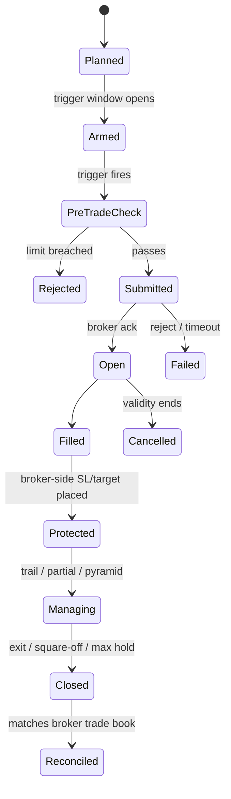

# 20 — Extended Modules (later phases)

Designed now so v1 leaves room for them; built after v1 is proven.

| Module | Phase | Container / project |
|--------|-------|---------------------|
| A. Automated order placement | P12 | `xd-exec` / `XDrishti.Execution` |
| B. Tick & order-book data | Recorder from P7, features P13 | `xd-feed` / `XDrishti.Feed` |
| C. Options & statistical arbitrage | P14 | Engine modules |
| D. Fundamentals & events | P15 | Worker jobs + assistant extraction |
| HFT / latency arbitrage | **Not pursued** | — |

## A. Automated order placement

**Modes per account:** `paper` → `manual_live` → `assisted` (system prepares exact order / super-order
parameters) → `semi_auto` (one-tap confirm in UI) → `auto_live` (within hard limits, every action notified).

- **Broker-side stop first** — protection never depends on the Mac staying up.
- Pre-trade checks: same limits as planning + price band vs LTP, freeze quantity, margin.
- Idempotent client order ids; order-update stream + end-of-day reconciliation; mismatch ⇒ freeze.
- Kill switch: ours (stop new, cancel pending, optional exit-all) + broker's where available; triggered by
  max drawdown, daily loss, feed loss or a button.
- Prerequisites: ISP static IP whitelisted at Dhan; daily login/2FA; ≤ 2 orders/s; Dhan sandbox testing first.

## B. Tick & order-book data

- Dhan live feed + **20-level depth** (up to 50 instruments/connection) and **200-level depth** (NSE equity
  & derivatives) over WebSocket (binary). No historical depth from brokers ⇒ record our own.
- Extends the v1 `xd-feed` (which already streams the active set): adds 20-level depth subscriptions for a
  configured recording list; writes to Timescale hypertables (compressed); ~50–100 GB/year.
- **Start recording in P7** so ≥ 6 months exist by P13.
- Uses: order-book imbalance, depth pressure near trigger, aggressive volume delta, spread → meta-model
  features and realistic slippage. Kept only if OOS improves.
- **HFT/latency arbitrage not pursued:** home latency vs co-located firms, order-rate limits and costs leave
  no retail edge.

## C. Options & statistical arbitrage

- Data: Dhan **option chain API** (OI, Greeks, IV, bid/ask; ~1 request / 3 s per underlying-expiry) and
  **expired options data API** for backtests; own chain snapshots (5-min for indices, EOD for stocks).
- Families: directional expression (ITM/ATM options for our signals), defined-risk debit spreads (swing),
  index credit spreads / iron condors in range regimes, event/IV-aware positioning.
- New learning dimension **instrument expression** (cash / future / option_buy / debit_spread …).
- Simulation from historical option prices; Black-Scholes with recorded IV only as fallback; premium and
  underlying-based exits; exit before expiry by default; liquidity filters (index options first).
- "Slow" statistical arbitrage: `PAIRS` (cointegration mean reversion) and `BASIS` (cash-futures) on 5m+
  bars — two-leg, so practical with module A.

## D. Fundamentals & events

- Data: exchange filings (results XBRL/PDF), shareholding (promoter holding, pledges), announcements,
  results calendar — stored **point-in-time by filing timestamp**.
- Uses: swing universe quality filter; features (growth, margin trend, surprise vs last 4 quarters,
  valuation percentile); `PEAD` (post-earnings drift) swing family; event-risk filter.
- Assistant extracts structured fields from PDFs/announcements, validated against XBRL; outputs are
  features measured like any other, never trade decisions.
