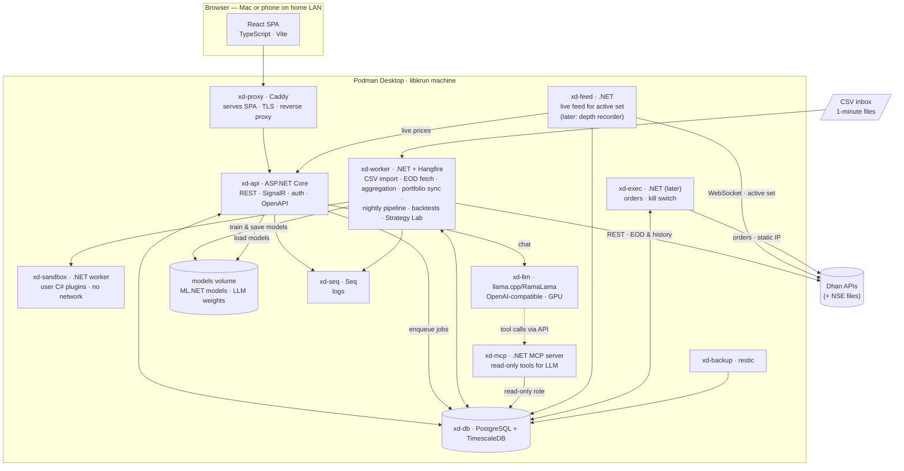
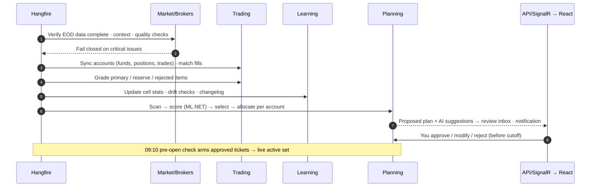

# 03 — Target Architecture

## 1. Architecture at a glance

**Style:** a **.NET modular monolith** (one codebase, clear module boundaries) deployed as a few
containers, with a **React** single-page app, **PostgreSQL + TimescaleDB** as the only database, **ML.NET** for machine
learning (no Python), and a **local LLM** — all on Podman Desktop.

Why a modular monolith (not microservices): one developer, one machine, shared engine code across
backtest / Strategy Lab / nightly scan / grading. Modules can be split into services later if ever needed.



## 2. Technology decisions

### 2.1 Frontend — React

| Concern | Choice | Reason |
|---------|--------|--------|
| Framework | **React 19 + TypeScript + Vite** | Your choice; fast dev build |
| UI kit | **MUI (Material UI)** + MUI X Data Grid (community) | Mature components, dense data tables |
| Price charts | **TradingView Lightweight Charts** (open source) | Candles with entry/stop/target/trail overlays, trade replay |
| Analytics charts | **Apache ECharts** (`echarts-for-react`) | Heatmaps, calendar, Monte Carlo fans, scatter, large data |
| Server state | **TanStack Query** | Caching, refetch, pagination |
| Routing | React Router | — |
| Forms | React Hook Form + Zod | Strategy form builder, config forms |
| Code editor | **Monaco** + `monaco-yaml` with JSON Schema | Strategy rules & config editing with live validation |
| Real-time | `@microsoft/signalr` | Live prices & P&L for the active set, job progress, notifications |
| File upload | `react-dropzone` + chunked upload | CSV imports with preview |
| API client | Generated from OpenAPI (`orval`) | Typed client, no hand-written DTOs |
| Tests | Vitest + Testing Library; Playwright for E2E | — |

### 2.2 Backend — .NET

| Concern | Choice | Reason |
|---------|--------|--------|
| Runtime | **.NET 10 (LTS)**, C# | Your choice; LTS support window |
| Web | **ASP.NET Core** (Minimal API endpoint groups), OpenAPI | Lightweight, typed |
| Real-time | **SignalR** | Progress & notifications to React |
| Data access | **EF Core + Npgsql** for domain tables; **Npgsql binary COPY / Dapper** for bulk bars | EF for productivity, raw speed for time series |
| Background jobs | **Hangfire + Hangfire.PostgreSql** | Cron schedules, retries, queues, built-in dashboard; no extra infra |
| Validation | FluentValidation; **JsonSchema.Net** for YAML config/strategy | One schema shared with the React editor |
| YAML | YamlDotNet | Trading config & strategy rules |
| Strategy DSL | Own parser (Superpower) → **compiled LINQ expression trees** | Safe (no eval), fast, look-ahead-checked |
| Indicators | Own streaming implementations (cross-checked against Skender.Stock.Indicators) | Point-in-time control, speed |
| Numerics | MathNet.Numerics | Statistics, Monte Carlo, Bayesian updates; own XIRR solver (Newton–Raphson + bisection) |
| CSV parsing | **Sep** or CsvHelper (streaming) + Npgsql binary COPY | Fast bulk import of 1-minute files |
| Live feed | `System.Net.WebSockets` client + binary packet parser (Dhan little-endian format) | Active-set streaming in `xd-feed` |
| Machine learning | **ML.NET** (LightGBM / FastTree trainers, PAV calibration, feature contributions) | Train and score in-process; one language, one code path |
| LLM client | **Microsoft.Extensions.AI** (OpenAI-compatible) | Tool calling against the local model |
| MCP server | **ModelContextProtocol C# SDK** | Read-only tools for the assistant / Hermes |
| HTTP resilience | Microsoft.Extensions.Http.Resilience (Polly) | Broker API retries, rate limits |
| Auth | ASP.NET Core Identity (single user, password) | Personal use; cookie auth |
| CLI | System.CommandLine (`xd` tool) | Strategy Lab and ops from terminal |
| Logging/telemetry | Serilog → **Seq**; OpenTelemetry metrics/traces | Local, searchable logs |
| Tests | xUnit, **Testcontainers** (real Postgres/Timescale), Verify snapshots | Engine correctness & look-ahead tests |

### 2.3 Data — PostgreSQL

| Concern | Choice | Reason |
|---------|--------|--------|
| Database | **PostgreSQL 17+** | Your choice |
| Time series | **TimescaleDB** extension (official image) | Hypertables + native compression for 1-min bars/ticks; **continuous aggregates** build 5m/10m/15m/30m/1h bars from 1m with 09:15 alignment; refreshed after CSV imports and EOD fetch |
| Queue | Hangfire tables in Postgres; `LISTEN/NOTIFY` for events | No separate broker (Redis/RabbitMQ) needed |
| Analytics | Plain SQL + materialised views for report aggregates | Single database to back up and query |
| Backups | `pg_dump` nightly + restic to external SSD | Simple, verifiable |

Estimated size: 1-min bars for ~200 symbols × 8 years ≈ 150 M rows → ~5–10 GB with Timescale compression.

### 2.4 ML — ML.NET only (no Python)

Our ML need is modest and well-defined: a **binary classifier on tabular features** (~10⁵–10⁶ rows,
~50–150 features) answering "does this candidate hit target before stop?", plus calibration and
explanations. ML.NET covers all of it:

| Need | ML.NET capability |
|------|-------------------|
| Gradient-boosted trees | `LightGbm` trainer (Microsoft.ML.LightGbm); `FastTree` (ML.NET's own GBDT) as fallback |
| Baselines | `LbfgsLogisticRegression`, `SdcaLogisticRegression` |
| Probability calibration | Calibrators incl. **PAV (isotonic)** and Platt; plus own reliability-curve check |
| Per-prediction explanation | `CalculateFeatureContribution` (supported for LightGBM/FastTree/linear models) |
| Global importance | Permutation Feature Importance (PFI) |
| Metrics | AUC, log-loss, Brier score via evaluation APIs + own walk-forward metrics |
| Persistence | Model `.zip` in the models volume + `research.model_versions` row; champion/challenger = DB pointer |

Flow: features and triple-barrier labels are computed by the same .NET code used for scanning → a
weekly Hangfire job trains, calibrates and validates per walk-forward fold → the model is saved and
registered → `PredictionEngine`/batch transform scores candidates in-process during the nightly run.

Why not Python: no second language/runtime, no extra container, no model-export hop, identical feature code
for training and scoring. What we give up — exact SHAP values, Optuna-style tuning, notebook ecosystem — is
not needed: feature contributions + PFI explain decisions, and the design deliberately avoids heavy tuning
(few parameters, plateaus).

**Platform check (Phase 0 spike):** containers on Apple Silicon are `linux/arm64`. Verify the LightGBM native
library loads there (if not, build `lib_lightgbm.so` from source in the worker image); fall back to the
managed `FastTree` trainer otherwise. The model sits behind an `IProbabilityModel` interface, so the trainer
can change without touching Planning or Learning.

### 2.5 AI

| Concern | Choice |
|---------|--------|
| Model server | **llama.cpp server** (pinned RamaLama image) in a container with GPU (libkrun); OpenAI-compatible API; started on demand ([ADR 0005](../adr/0005-local-llm-runtime-and-models.md)) |
| Model | Qwen3-30B-A3B at 4-bit (alternate gpt-oss-20b), 16K default / 32K supported context; no separate small model |
| Integration | Assistant endpoint in `xd-api` (Microsoft.Extensions.AI) + `xd-mcp` read-only tool server |
| Optional | Hermes Agent as hardened front-end after PoC ([doc 14](14-ai-assistant.md)) |

### 2.6 Infrastructure

| Concern | Choice |
|---------|--------|
| Containers | **Podman Desktop**, libkrun machine (GPU for LLM), `compose.yaml` with profiles |
| Proxy | **Caddy** — serves the React build, local TLS, routes `/api`, `/hubs`, `/hangfire` |
| Secrets | macOS Keychain → Podman secrets → .NET `KeyPerFile` configuration provider |
| Logs | Seq (free single-user) |
| Backups | restic → external SSD |

## 3. Modules (inside the .NET solution)

| Module | Responsibility |
|--------|----------------|
| **Market** | Bars, aggregation, context, calendar, corporate actions, data quality |
| **Data import** | CSV profiles, import jobs (preview, validate, upsert, undo), folder watcher |
| **Catalog** | Instrument master, tracked instruments, baskets (manual / rule / system), membership history |
| **Live** | Active-set computation, WebSocket subscriptions, live 1-minute bars, quote polling, live P&L & alerts |
| **Brokers** | Adapters (Dhan in v1; Upstox later; NSE files) implementing `IMarketDataProvider`, `ILiveFeed`, `IAccountReader`, `ITokenProvider`, (later) `IOrderExecutor` |
| **Portfolio** | Transactions, FIFO lots, positions, buckets, valuations, returns, XIRR, benchmark, alerts |
| **Indicators & Features** | Streaming indicators, multi-timeframe features, regime labels |
| **Strategies** | Built-in strategies, DSL parser/compiler, plugin host |
| **Simulation** | Event-driven bar-by-bar engine: conditional entries, exits, pyramids, gaps, costs, slippage, MAE/MFE |
| **Learning** | Walk-forward runner, cell stats (Bayesian), exit selection, drift, lifecycle, hypothesis loop, ML.NET training & scoring, execution feedback, lessons, experiments (replay), autonomy rules |
| **Planning** | Scanner, scorer, selector, per-account allocator, pre-open check |
| **Trading** | Accounts, sync, journal, fill matching, outcomes grading, (later) execution |
| **Lab** | Strategy submissions, test runs, verdicts, test ledger |
| **Reporting** | Report queries with lenses (all / basket / instrument / trade / strategy / account), aggregates, exports |
| **Assistant** | LLM chat, tool routing, briefings |
| **Workflow** | Proposals, approvals (plan tickets, suggestions), review cutoff, suggestion inbox, pre-trade checklist |
| **Insights** | Portfolio action-center rules, price alerts, report auto-insights ([doc 15](15-smart-insights-and-automation.md)) |
| **Data quality** | Validation runs (completeness, sanity, spikes, stored vs recomputed aggregates, derived vs official daily), repairs, quality score |
| **Scheduling** | Service schedules (DB-stored), dependency & timing rules, run-after chains, catch-up, failover |
| **Platform** | Config versions, auth (Identity, password re-entry), audit, notifications, commands, service runs |

**Single code path:** Simulation + Strategies + Features are used identically by the Strategy Lab,
walk-forward learning, the nightly scanner and the outcome grader.

## 4. Repository & solution structure

One repository (monorepo) holds the code, configuration, deployment and design material.

```
xDrishti/
├── backend/                         # .NET 10 solution
│   ├── XDrishti.slnx                # solution (src/, tests/ folders)
│   ├── global.json                  # SDK pin + Microsoft Testing Platform
│   ├── Directory.Build.props        # shared build settings, analyzers, nullable, warnings-as-errors
│   ├── Directory.Packages.props     # central package versions
│   ├── Dockerfile                   # multi-stage: targets api, worker (chiseled, non-root)
│   ├── contracts/XDrishti.Api.json  # OpenAPI contract generated at build (source of frontend types)
│   ├── src/
│   │   ├── XDrishti.Domain/         # entities & value objects: Bar, Instrument, Signal, TradeTicket, RMultiple, Cell…
│   │   ├── XDrishti.Application/    # use cases, interfaces (ports), pipeline orchestration
│   │   ├── XDrishti.Infrastructure/ # EF Core, Npgsql COPY, Timescale, secrets, LLM client, model store, default seed
│   │   ├── XDrishti.Brokers.Dhan/   # REST + WebSocket feed + instrument master
│   │   ├── XDrishti.Brokers.Nse/    # optional reconciliation files
│   │   ├── XDrishti.DataImport/     # CSV profiles, parsers, import jobs
│   │   ├── XDrishti.Catalog/        # instruments, tracked list, baskets
│   │   ├── XDrishti.Portfolio/      # lots, positions, valuations, XIRR
│   │   ├── XDrishti.Indicators/
│   │   ├── XDrishti.Strategies/     # built-ins + DSL (parser, compiler, look-ahead lint) + plugin host
│   │   ├── XDrishti.Simulation/
│   │   ├── XDrishti.Learning/       # cells, meta-model, smart rules, experiments, lessons
│   │   ├── XDrishti.Planning/
│   │   ├── XDrishti.Hosting/        # shared host defaults: KeyPerFile secrets, Serilog, app info
│   │   ├── XDrishti.Api/            # host: endpoints, SignalR hubs, auth, OpenAPI; `migrate` command
│   │   ├── XDrishti.Worker/         # host: Hangfire server, scheduled services
│   │   ├── XDrishti.Mcp/            # host: MCP read-only tool server
│   │   ├── XDrishti.Cli/            # `xd` command-line tool
│   │   ├── XDrishti.Feed/           # host: market-hours live feed for the active set (later: depth recorder)
│   │   └── XDrishti.Execution/      # host (later): order service
│   └── tests/                       # Domain/Application unit, Architecture (layer rules), Api.IntegrationTests (Testcontainers)
├── frontend/                        # React 19 + TypeScript + Vite + MUI; Dockerfile builds xd-proxy (Caddy + app)
│   └── src/{app, features/<name>, shared/{api,ui,lib}, theme, test}
├── data/                            # local runtime data, git-ignored: inbox/ (CSV drop, mounted into xd-worker), exports/, models/
├── deploy/                          # compose.yaml (+ compose.dev.yaml), caddy/Caddyfile, db/init, xd-up.sh / xd-down.sh
├── scripts/                         # check.sh (all gates), gen-api.sh, dev-api.sh, build-docs.sh, serve.sh
├── docs/
│   ├── design/                      # these design documents (Markdown source of truth)
│   ├── adr/                         # architecture decision records
│   ├── engineering/                 # engineering standards (SOLID, modularity, testing, performance, DoD)
│   ├── prototype/                   # clickable UX prototype (reference for the React app)
│   └── site/                        # generated HTML version of docs/design
└── tools/                           # docs-site builder, prototype vendoring
```

Trading configuration and strategies are **not repository folders**: they live in the database (versioned,
validated, audited) and are managed in the app; built-in defaults ship inside the backend and are seeded on first
start ([ADR 0002](../adr/0002-config-and-strategies-in-app.md)).

Dependency rule: `Domain` ← `Application` ← (`Infrastructure`, `Brokers.*`, engine modules) ← hosts.
Engine modules (Indicators, Strategies, Simulation, Learning, Planning) have **no I/O dependencies** —
they're pure and fully unit-testable.

## 5. Data model (PostgreSQL schemas)

| Schema | Key tables |
|--------|-----------|
| `market` | `instruments`, `instrument_broker_ids`, `bars_1m` (hypertable, source csv/dhan), `bars_1m_live`, `bars_1d`, continuous aggregates `bars_5m…bars_1h`, `context_daily`, `calendar`, `corporate_actions`, (later) `ticks`, `depth` |
| `catalog` | `tracked_instruments`, `baskets`, `basket_members` (valid_from/to), `index_membership` |
| `data` | `import_profiles`, `import_jobs`, `import_issues` |
| `portfolio` | `transactions`, `lots`, `lot_closures`, `positions`, `buckets`, `cash_flows`, `valuations_daily`, `corporate_action_adjustments` |
| `research` | `sim_runs`, `sim_trades` (with MAE/MFE, R, exit reason, feature snapshot), `cell_stats`, `exit_choices`, `regimes`, `training_sets`, `model_versions`, `hypotheses`, `learning_changelog`, `lessons`, `experiments`, `execution_gap` (per trade: plan vs fill), `autonomy_settings`, `smart_rules`, `meta_models`, `entry_windows`, `loss_tags`, `digests` |
| `trading` | `accounts`, `account_roles`, `account_snapshots`, `plans`, `plan_items` (primary/reserve/rejected), `outcomes`, `journal_entries`, `fills`, (later) `orders`, `order_events` |
| `lab` | `strategies`, `strategy_versions`, `lab_runs`, `lab_results`, `test_ledger` |
| `config` | `config_versions` (YAML, hash, author, activated_at), `active_config` |
| `ops` | `commands`, `service_schedules`, `service_runs`, `validation_runs`, `validation_results`, `data_quality_issues`, `audit_log`, `notifications` |
| `insights` | `alerts`, `action_items` (status: open / snoozed / done), `action_thresholds` |
| `workflow` | `approvals`, `suggestions` |
| `auth` | ASP.NET Core Identity tables (owner user, password hash, lockout) |
| `ai` | `conversations`, `tool_calls` (audit) |
| `hangfire` | job storage |

Every decision-relevant row carries `as_of` timestamps and the `config_version` / `model_version` used.

## 6. API surface (REST + SignalR)

| Area | Endpoints (examples) |
|------|----------------------|
| Instruments & baskets | `GET /api/instruments?q=&type=&sector=` · `POST /api/tracked` · `DELETE /api/tracked/{id}` · `GET/POST/PUT /api/baskets` · `POST /api/baskets/{id}/members` · `GET /api/baskets/{id}/preview` (rule) |
| Data import | `POST /api/imports` (upload) · `POST /api/imports/{id}/preview` · `POST /api/imports/{id}/commit` · `POST /api/imports/{id}/undo` · `GET/PUT /api/import-profiles` |
| Portfolio | `GET /api/portfolio?groupBy=&asOf=` (groupBy: bucket, basket, account, strategy, sector) · `GET /api/portfolio/positions/{id}` · `POST /api/portfolio/transactions` (manual/CSV) · `GET /api/portfolio/history?from=&to=` |
| Live | `GET /api/live/active-set` · `PUT /api/live/pins` |
| Plans | `GET /api/plans?date=&account=` · `GET /api/plans/{id}` · `POST /api/plans/{id}/preopen-check` |
| Journal | `GET /api/journal?from=&to=` · `PATCH /api/journal/{id}` (taken/skipped/notes) |
| Reports | `GET /api/reports/{type}?lens=&from=&to=&basket=&strategy=&tf=&side=&exit=&regime=&account=` · `GET /api/reports/{type}/export?format=` |
| Learning | `GET /api/cells` · `GET /api/cells/{key}` · `GET /api/changelog` · `POST /api/changelog/{id}/revert` · `GET/POST /api/hypotheses` · `GET /api/learning/journey` · `GET /api/lessons` · `GET /api/execution-gap` · `POST /api/experiments` (replay job, SignalR progress) · `POST /api/experiments/{id}/shadow` · `POST /api/experiments/{id}/apply` · `GET/PUT /api/autonomy` · `GET/PUT /api/smart-rules` · `GET /api/smart-rules/evidence` · `GET /api/digest/latest` · `GET /api/loss-tags` |
| Strategy Lab | `POST /api/lab/strategies` · `POST /api/lab/validate` · `POST /api/lab/runs` · `GET /api/lab/runs/{id}` · `POST /api/lab/runs/{id}/promote` |
| Config | `GET /api/config` · `POST /api/config/drafts` · `POST /api/config/drafts/{id}/validate` · `POST /api/config/drafts/{id}/activate` |
| Auth | `POST /api/auth/login` · `POST /api/auth/logout` · `POST /api/auth/reauth` |
| Accounts | `GET/POST/PUT /api/accounts` · `PUT /api/accounts/{id}/roles` (step-up) · `POST /api/accounts/{id}/test` · `POST /api/accounts/{id}/sync` |
| Approvals | `GET /api/plans/{date}/review` · `POST /api/plans/items/{id}/{approve, modify, reject}` · `POST /api/plans/{date}/approve-all` |
| Suggestions | `GET /api/suggestions?status=` · `POST /api/suggestions/{id}/accept` · `POST /api/suggestions/{id}/reject` |
| Services | `GET /api/services` · `PUT /api/services/{id}/schedule` (validated against dependency rules) · `POST /api/services/{id}/run` · `POST /api/services/{id}/pause` · `GET /api/services/{id}/runs` |
| Data quality | `GET /api/quality?status=` · `GET /api/quality/{symbol}` (checks, stored vs recomputed) · `POST /api/quality/run` · `POST /api/quality/{symbol}/repair` |
| Insights | `GET /api/portfolio/actions?account=&severity=` · `POST /api/portfolio/actions/{key}/{snooze, done}` · `GET/POST/DELETE /api/alerts` · `GET /api/reports/insights` |
| Risk profiles | `GET/POST/PUT/DELETE /api/risk-profiles` (step-up) |
| Data | `GET /api/data/quality` · `GET /api/data/coverage` |
| Assistant | `POST /api/assistant/chat` (streaming) |
| Real-time | SignalR `/hubs/events`: live prices & P&L (active set), alerts, job/import progress, nightly status |

## 7. Key flows

### Daily timeline (trading day)

| Time (IST) | What runs |
|------------|-----------|
| 09:00–15:35 | `xd-feed`: live data for the active set; quote polling for holdings; live P&L & alerts |
| 09:10 | Pre-open check arms approved tickets (after the 09:05 review cutoff) |
| ~15:50 | EOD fetch: today's 1-minute + daily for all tracked instruments, gap backfill, aggregates refresh |
| ~16:30 | Account sync: holdings, positions, trade history, ledger → portfolio & auto-journal; daily valuation |
| ~18:30 | Nightly pipeline (below) → next-day plan |

### Nightly pipeline (Hangfire recurring job, ~18:30 IST)

Weekly: retrain/recalibrate (ML.NET job), exit re-selection, hypothesis loop. Monthly: full walk-forward review.

### CSV import
Upload or drop files → profile detection & preview in React → commit → Hangfire job parses (streaming),
validates, maps symbols, bulk-COPYs into `bars_1m`, refreshes aggregates for the affected range → import report
via SignalR → instruments auto-tracked. Details: [05-data-and-brokers.md](05-data-and-brokers.md) §3.

### Live active set
Planning (armed tickets) + Portfolio (open positions, holdings) + context indices + pins → `xd-feed` diffs the set
and (un)subscribes on the Dhan WebSocket → ticks → live 1-minute bars + LTP → Portfolio/alerts → SignalR to React.

### Strategy Lab run
React editor → `POST /api/lab/runs` → Hangfire job in `xd-worker` (plugins in `xd-sandbox`) → progress over
SignalR → results in `lab` schema → report page. Details: [11-strategy-lab.md](11-strategy-lab.md).

## 8. Security

- **Login required everywhere**: single owner, ASP.NET Core Identity (password), idle timeout, lockout, password re-entry for sensitive actions
  for sensitive actions; HTTPS via Caddy on LAN; optional WireGuard for remote access ([doc 04](04-accounts-access-and-operations.md) §2).
- **Service identity**: background services act on persisted desired state, not on user sessions; every action
  records the configuring actor for audit.
- Secrets per container via Podman secrets; only `xd-worker`/`xd-feed` (data/account tokens) and later
  `xd-exec` (order tokens) receive broker secrets.
- `xd-mcp` and the LLM use a **read-only database role**; no tool can change config, plans or orders.
- `xd-sandbox` has no network and a read-only data mount.
- Audit log for config activations, promotions, approvals and (later) orders.
